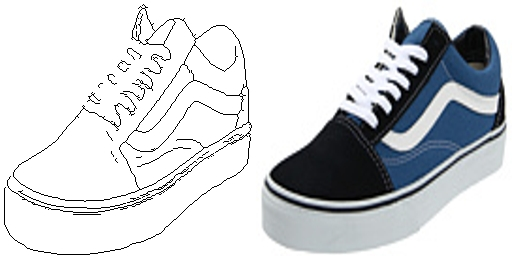

# Pix2Pix (Edges2Shoes)

This project replicates the implementation of image-image translation from Pix2Pix project. The project only
focuses on implementing Edges to Shoes image translation using PyTorch.



The original study and codes can be found on <a href="https://github.com/junyanz/pytorch-CycleGAN-and-pix2pix">here</a>

## Prerequisites

- Linux or macOS
- Python 3
- PyTorch
- Jupyter Notebook
- GPU (alternativey you can use GPU provided by GCP or AWS)

## Getting Started

Download the Edges2Shoes dataset. The dataset contains 50K of various shoes images which can be found in [UT Zappos50K website](http://vision.cs.utexas.edu/projects/finegrained/utzap50k/).

Alternatively, you can download the dataset via _wget_ from the terminal or jupyter notebook.

```sh
wget "http://efrosgans.eecs.berkeley.edu/pix2pix/datasets/edges2shoes.tar.gz" -P "DESTINATION_PATH"
```

**_Note_:** Using second option is more ideal as the downloaded dataset contains both preprocessed HED and original images.

## Development setup

You can run the jupyter notebook on local machine that installed with GPU.

This project also provides an example of [notebook](008_Colab_Custom_Dataset_2000Training.ipynb) that was ran in google Golab. However, the notebook only trained with 2000 training images due to some contraints in performing training with GCP. It took about eight hours to train 500 training epochs with GCP.

_Input Image_


_True Image_


_Image Generated by the Model_


## Acknowledgements

1. Refer from https://github.com/junyanz/pytorch-CycleGAN-and-pix2pix
2. https://github.com/mrzhu-cool/pix2pix-pytorch
3. MachineLearning Mastery on https://machinelearningmastery.com/how-to-develop-a-pix2pix-gan-for-image-to-image-translation/
4. Udacity Deep Learning (https://github.com/udacity/deep-learning-v2-pytorch)
